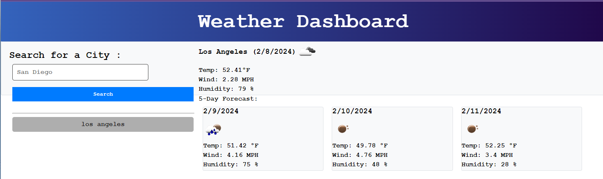
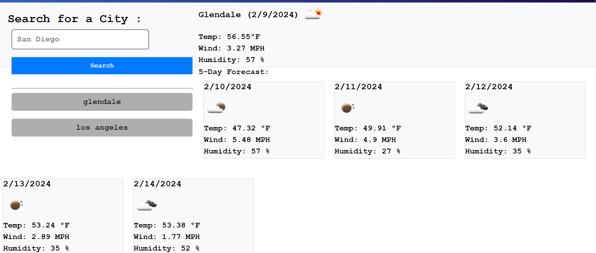

# weatherAPI

As the student, I was instructed to create a weather app that properly displays the weather for any city of my choosing for the next five days. I will be using a weather API to in order to collect this information.

## USER STORY

AS a user, I WANT a weather app that can tell me what the weather is going to be like for the week SO THAT I am prepared for the weather condition

## ACCEPTANCE CRITERIA

GIVEN I am using a weather app
WHEN I open the application
THEN I am presented with a search bar 
WHEN I enter the City of my choice
THEN I can press the search button
WHEN the weather for the location pops up
THEN I can see the weather for the next 5 days
WHEN I search for a new city location 
THEN the previous location is shown under the searh button 

## MOCK UP 

## RESOURCES 

https://openweathermap.org/forecast5

## LINKS

https://github.com/amanda-er/weatherAPI.git

